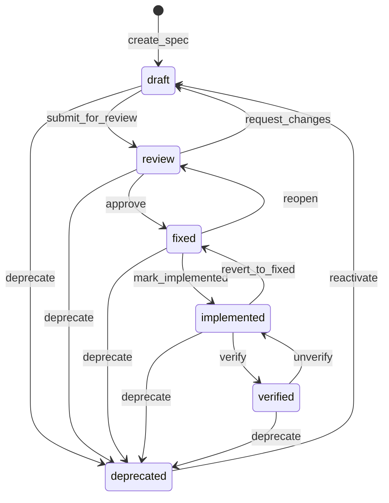

# State Machine

Every specification node has a `status` field that represents its position in a defined lifecycle. Transitions between states are explicit, validated, and recorded in the event log.

---

## States

| State | Description |
|---|---|
| `draft` | Under active authoring. Content is unstable and subject to change. |
| `review` | Submitted for review. Edits require an explicit transition back to `draft` first. |
| `fixed` | Agreed upon by stakeholders. Considered stable. |
| `implemented` | The corresponding artefact (code, configuration, document) exists. |
| `verified` | Independently confirmed correct by test, audit, or formal check. |
| `deprecated` | Superseded or no longer applicable. Retained for history. |

---

## Transition Diagram



---

## Valid Transitions Table

| From | To | Trigger | Notes |
|---|---|---|---|
| `draft` | `review` | `submit_for_review` | Locks the spec from further edits until reviewed |
| `draft` | `deprecated` | `deprecate` | Abandoning a draft |
| `review` | `draft` | `request_changes` | Reviewer sends it back for rework |
| `review` | `fixed` | `approve` | Stakeholder approval |
| `review` | `deprecated` | `deprecate` | Rejected during review |
| `fixed` | `implemented` | `mark_implemented` | Code/artefact created |
| `fixed` | `review` | `reopen` | Re-evaluation needed |
| `fixed` | `deprecated` | `deprecate` | Superseded before implementation |
| `implemented` | `verified` | `verify` | Acceptance test or audit passed |
| `implemented` | `fixed` | `revert_to_fixed` | Implementation reverted |
| `implemented` | `deprecated` | `deprecate` | Implementation abandoned |
| `verified` | `deprecated` | `deprecate` | Spec removed from active scope |
| `verified` | `implemented` | `unverify` | Verification retracted |
| `deprecated` | `draft` | `reactivate` | Resurrecting a deprecated spec |

Any transition not listed above is **invalid** and will be rejected by the validator and apply engine.

---

## Transition Rules

### Rule 1: No arbitrary skipping

You cannot jump from `draft` directly to `verified`. Every transition must follow an allowed edge in the graph. The apply engine enforces this.

### Rule 2: Deprecation is always available

Any spec in any non-deprecated state can be deprecated. Deprecated specs are not deleted; they remain in state for history and relation resolution.

### Rule 3: Reactivation always returns to `draft`

When a deprecated spec is reactivated, it returns to `draft`, not to whatever state it was in before deprecation. This prevents accidental promotion of stale specs.

### Rule 4: `fixed` is the canonical stable state

For dependency tracking and formal export purposes, `fixed` is the minimum status for a spec to be considered stable. The validator warns when a `depends_on` relation targets a spec still in `draft` or `review`.

### Rule 5: `verified` has special validation semantics

A spec in `verified` status may carry formal constraint expressions in the `constraints` table. The export pipeline will only emit constraints for `verified` specs (unless `--include-all` is passed).

---

## Event Log Entries for Transitions

Every status transition writes a `change_status` event to the event log:

```json
{
  "event_type": "change_status",
  "spec_id": "CMD-IMPORT",
  "payload_json": {
    "from_status": "draft",
    "to_status": "review",
    "transition": "submit_for_review",
    "actor": "cli"
  },
  "created_at": "2024-01-15T10:30:00Z"
}
```

---

## Validation Errors Related to State

| Error Code | Description |
|---|---|
| `E_INVALID_TRANSITION` | Attempted transition is not in the valid edges table |
| `E_DRAFT_DEPENDENCY` | A `fixed`/`implemented`/`verified` spec depends on a `draft` spec |
| `E_DEPRECATED_DEPENDENCY` | A non-deprecated spec depends on a `deprecated` spec |
| `E_SELF_TRANSITION` | `from_status` == `to_status` (no-op; rejected) |

See [CLI Reference](cli-reference.md) for the `validate` command and [Error Catalogue](#error-catalogue) for full error definitions.

---

## CLI Commands for Status Management

```bash
# Transition a spec to review
speqlite state transition CMD-IMPORT --to review

# Approve a spec (review → fixed)
speqlite state transition CMD-IMPORT --to fixed

# Mark as implemented
speqlite state transition CMD-IMPORT --to implemented

# Deprecate
speqlite state transition CMD-IMPORT --to deprecated

# Bulk status listing
speqlite state list --status draft
speqlite state list --status review
```

All transitions go through the plan/apply workflow: `state transition` generates a plan entry; `apply` commits it.
